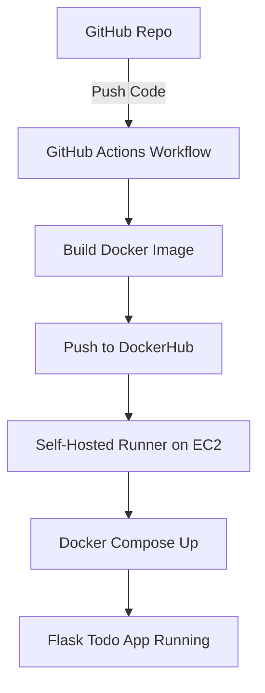

# Flask Todo App with CI/CD and Terraform

## Project Overview
This is a simple **Flask-based Todo List web application** built with a web interface. It demonstrates a complete DevOps workflow involving containerization, CI/CD automation, and infrastructure provisioning.

## Features :
- Flask Todo application with HTML interface
- Dockerized using **Multistage Dockerfile** for lightweight image
- CI/CD pipeline using **GitHub Actions**
- Deployment to **AWS EC2** using a **Self-Hosted GitHub Runner**
- Infrastructure provisioning via **Terraform**

---


## Docker & Containerization
The application is packaged using a **Multistage Dockerfile** to ensure smaller image size and better layer optimization. This is especially useful as the project scales and dependencies increase.

Docker Compose is used to manage the container during deployment, making it easier to start/stop services and handle environment variables.


---

## CI/CD with GitHub Actions
A GitHub Actions workflow is configured to automate the following:
- Build the Docker image from the latest code pushed to the `main` branch
- Push the image to **DockerHub**
- Log in to a **self-hosted GitHub runner** running on an EC2 instance
- Pull the latest Docker image
- Use Docker Compose to run the container
  

### Why DockerHub over Amazon ECR?
While Amazon ECR is a managed container registry, it incurs additional data transfer costs when pulling images to EC2. To avoid this, **DockerHub** was chosen as the container registry in this project.

---

## Infrastructure as Code with Terraform
To automate the provisioning of cloud infrastructure, **Terraform** was used. The following resources are created and configured:
- An **EC2 instance** (Ubuntu 22.04) in the `ap-south-1` region
- A **Security Group** allowing:
  - HTTP (port 80)
  - HTTPS (port 443)
  - Flask app port (5000)
  - SSH (port 22)
- Bootstrapping the instance with **Docker and Docker Compose** via `user_data`

This makes the deployment environment:
- Reproducible
- Version controlled
- Easy to scale and modify

---

## Project Structure
```
.
├── app.py                     
├── Dockerfile                
├── docker-compose.yml       
├── .github/workflows/
│   └── build-deploy-pipeline.yml           
├── terraform/
│   |── main.tf              
└── README.md                
```

---

## Getting Started
### 1. Clone the repository
```bash
git clone https://github.com/Vaishnavi639/AFTO-Task.git
cd flask-todo-devops
```

### 2. Deploy Infrastructure with Terraform
```bash
cd terraform
terraform init
terraform plan
terraform apply
```

### 3. Configure GitHub Self-Hosted Runner
- SSH into the EC2 instance
- Install GitHub Actions Runner
- Register the runner to your GitHub repo.

### 4. Push Code to Trigger CI/CD
- Any push to `main` will trigger the pipeline to build, push image to DockerHub, and deploy it on EC2.

---
## Domain & SSL Setup

To make the Flask app publicly accessible via a secure HTTPS URL, the following was implemented:

- **Free Subdomain via DuckDNS**  
  A free dynamic DNS service — [DuckDNS](https://www.duckdns.org/) — was used to assign a custom domain:  
 https://vyom.duckdns.org`  
  DuckDNS automatically maps the domain to the EC2 instance's public IP (in this case, an Elastic IP for static mapping).

- **SSL Certificate via Let’s Encrypt**  
  Used **Certbot** with the **nginx plugin** to provision and install an SSL certificate for the DuckDNS subdomain.  
  This ensures all traffic is encrypted over HTTPS.

- **NGINX as Reverse Proxy**  
  NGINX is configured to:
  - Listen on ports `80` and `443`
  - Proxy requests to the Flask app running in Docker
  - Redirect HTTP to HTTPS for secure communication

This combination provides:
- A clean public URL instead of raw IP
- Encrypted traffic via HTTPS
- Production-style setup using open-source tooling

  

##  Technologies Used
- Flask 
- Docker & Docker Compose
- GitHub Actions
- AWS EC2
- Terraform

---



